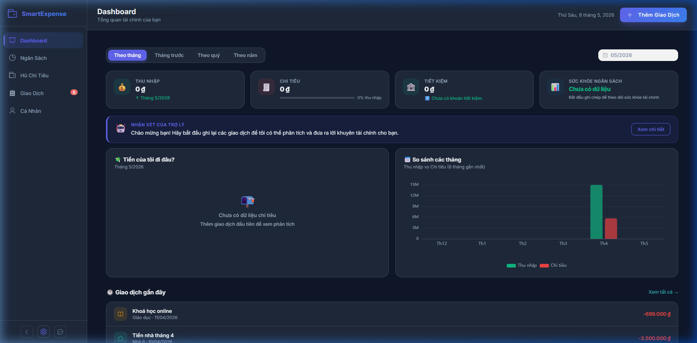
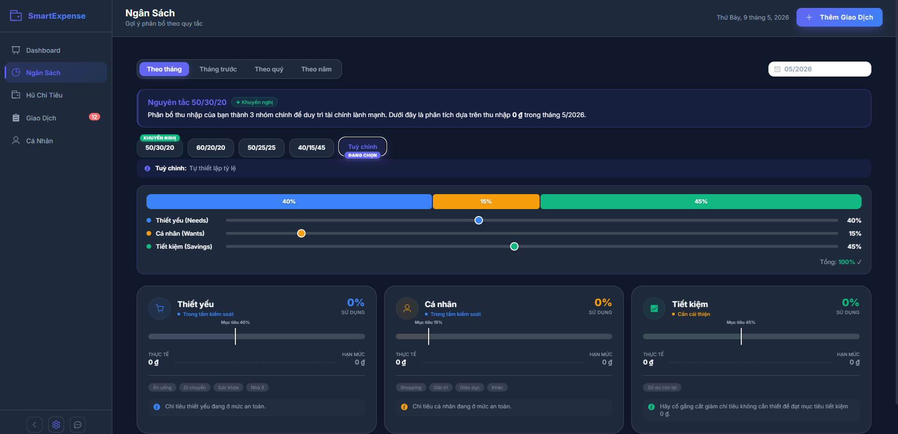
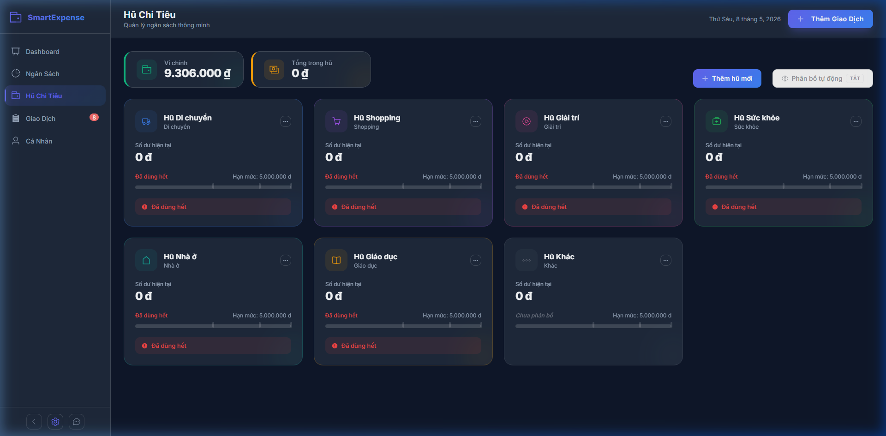
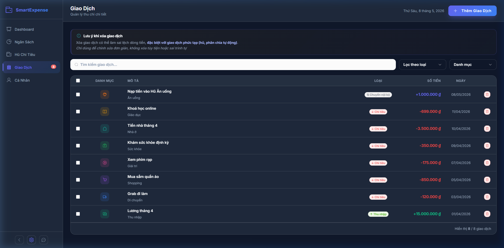
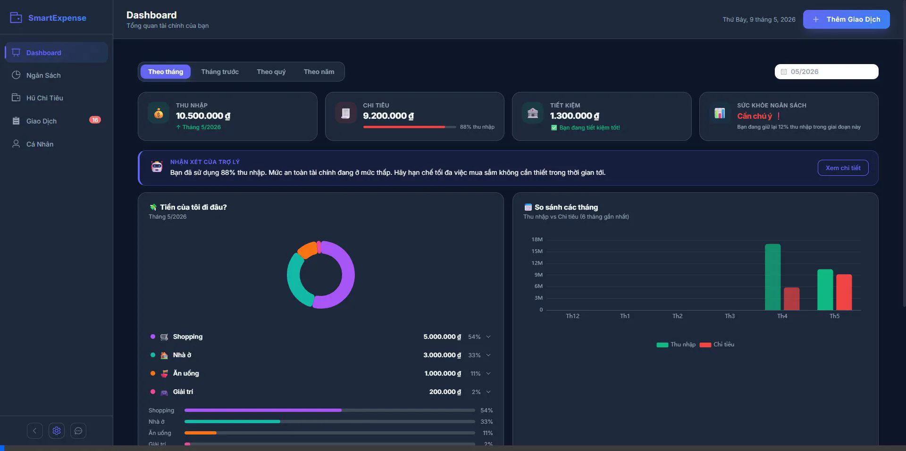

# Smart Expense Tracker

  
  
  
  
  

---

## 📖 Giới thiệu

**Smart Expense Tracker** là ứng dụng quản lý tài chính cá nhân hiện đại được xây dựng bằng **Vue 3 + Vite**. Với giao diện **Dark/Blue/White Mode** sang trọng, hiệu ứng chuyển động mượt mà, biểu đồ phân tích sâu và hệ thống phân bổ ngân sách thông minh, ứng dụng mang lại trải nghiệm quản lý tài chính cao cấp ngay trên trình duyệt.

---

# ✨ Tính năng nổi bật

## 📊 Dashboard Tổng Quan

  

- Thẻ số liệu nhanh: số dư, tổng thu, tổng chi, tỷ lệ tiết kiệm
- Biểu đồ cơ cấu chi tiêu (Donut Chart) và so sánh thu/chi theo tháng (Bar Chart)
- Trợ lý AI phân tích thói quen & đưa ra gợi ý tối ưu ngân sách

---

## 💰 Theo Dõi Ngân Sách (Budget)

  

- Hỗ trợ các quy tắc phân bổ phổ biến: **50/30/20**, **60/20/20**, **50/25/25**, **40/15/45**
- Tuỳ chỉnh tỷ lệ linh hoạt với thanh trượt interactive, tự cân bằng tổng 100%
- Phân tích 3 nhóm chi tiêu: **Thiết yếu / Cá nhân / Tiết kiệm**
- Lọc theo **tháng / tháng trước / quý / năm**
- Thanh tiến độ với mốc mục tiêu động
- **Budget Projection** mô phỏng phân bổ tức thì
- Lưu preset & custom ratio vào `localStorage`

---

## 🏺 Hệ Thống Hũ Chi Tiêu (Jar System)

  

- Tạo / chỉnh sửa / giải thể hũ với icon và màu sắc tùy chỉnh
- Nạp / rút tiền nội bộ giữa ví chính và hũ
- Milestone progress (50% / 80% / 100%)
- Tự động phân bổ thu nhập theo tỷ lệ cấu hình

---

## 📝 Quản Lý Giao Dịch

  

- 4 loại giao dịch: Thu nhập / Chi tiêu / Chuyển nội bộ / Điều chỉnh
- Lọc theo loại, danh mục; tìm kiếm theo mô tả
- Xóa hàng loạt với checkbox
- Chặn xóa gây âm số dư hũ

---

## 📱 Mobile Experience

  

- Bottom Navigation tối ưu cho mobile
- Vuốt cạnh màn hình để mở sidebar
- Animation & transition mượt mà
- Responsive cho cả tablet và điện thoại

---

## 🎨 Cá Nhân Hóa

- 3 chủ đề giao diện:
  - 🌞 White Mode
  - 🌌 Blue Mode
  - 🌑 Dark Mode

- Quản lý profile cá nhân
- Reset toàn bộ dữ liệu từ Settings

---

## 💾 Lưu Trữ

- Toàn bộ dữ liệu lưu bằng `localStorage`
- Không cần đăng nhập
- Không cần backend/server

---
